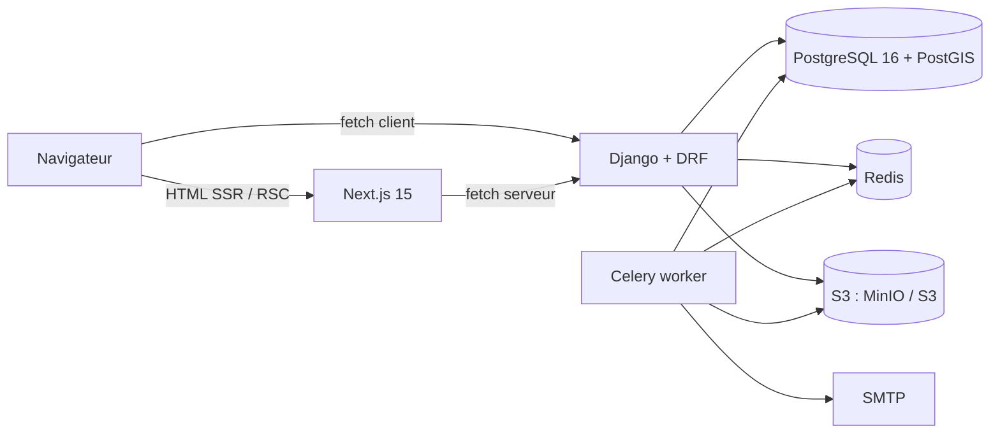

# Architecture

## Vue d'ensemble



- **Next.js** rend toutes les pages publiques côté serveur (SSG + revalidation pour les pages ville/quartier/bien, SSR pour la recherche). Il ne touche jamais la base : il appelle l'API REST.
- **Django** expose `/api/v1/`, documentée en OpenAPI (drf-spectacular). Le front génère ses types TypeScript depuis ce schéma (`make types`).
- **Celery** traite l'asynchrone : variantes d'images WebP, emails, sitemap, synchronisation iCal, expiration des demandes.
- **PostGIS** porte la recherche géographique (rayon, polygone de quartier).

## Découpage Django

Une app par domaine métier. Chaque app suit la même structure :

```
<app>/
  models.py       # modèles + choices
  services.py     # logique métier, transitions d'état
  selectors.py    # requêtes de lecture réutilisables (optionnel)
  serializers.py
  views.py
  urls.py
  admin.py
  factories.py    # factory_boy
  tests/
```

Règles :
- Les vues et serializers n'appliquent aucune règle métier. Elles valident la forme et délèguent aux services.
- Les statuts ne sont jamais assignés directement. `listings.services.publish_property(...)`, `bookings.services.accept_request(...)`, etc. lèvent `InvalidTransition` si la transition n'est pas autorisée.
- Les données sensibles ont un accès dédié et loggé (`core.private_storage`).

## Découpage Next.js

```
app/
  (public)/    pages indexables, layout avec Header/Footer
  (auth)/      connexion, inscription
  (account)/   voyageur
  (host)/      propriétaire
  (admin)/     équipe
components/    ui (shadcn), listing, search, layout
lib/api/       client fetch typé + types générés
lib/seo/       metadata, JSON-LD, breadcrumbs
lib/i18n/      dictionnaires (FR au MVP)
```

## Revalidation ISR

Les pages ville, quartier et fiche sont générées à la demande (ISR, `revalidate` 5 à 10 min) et régénérées immédiatement quand l'API publie, met en pause ou re-tarife un bien : `listings.services.revalidate_property_pages` → tâche Celery `notifications.tasks.revalidate_front` → `POST /api/revalidate` (secret partagé `REVALIDATE_SECRET`). Le build de production ne contacte jamais l'API.

## Stockage des fichiers

| Bucket | Contenu | Accès |
|---|---|---|
| `loka-public` | Variantes WebP des photos de biens, images OG | Lecture anonyme, cache long |
| `loka-private` | Originaux des photos, documents d'identité, contrats PDF | URL signée (5 min), générée par l'API après contrôle des permissions, accès loggé |

L'adresse exacte d'un bien est stockée en base (`address_private`) et n'est exposée qu'aux hôtes du bien, au staff, et au voyageur d'une réservation confirmée.

## Sauvegardes

La base PostgreSQL est sauvegardée chaque nuit (tâche Celery `core.tasks.backup_database`, 03:00 Africa/Tunis) : `pg_dump -Fc`, chiffrement symétrique Fernet avec `BACKUP_ENCRYPTION_KEY`, dépôt dans le bucket privé sous `backups/db/AAAA/MM/`. Rétention : 7 quotidiennes + 4 hebdomadaires. Sans clé configurée, les sauvegardes sont désactivées. Commandes `backup_db`, `list_backups`, `restore_db` (destructive, double garde-fou). Procédure complète de restauration et checklist de reprise : [docs/backups.md](backups.md).

## Environnements

| | dev | prod |
|---|---|---|
| Settings | `config.settings.dev` | `config.settings.prod` |
| Front | `next dev` avec volume monté | image standalone |
| Stockage | MinIO local | S3 ou compatible |
| Emails | console | SMTP |
| Paiement | `MockPaymentProvider` | Konnect / ClicToPay / Flouci (plus tard) |

## CI/CD

GitLab CI : `lint` (ruff, mypy, eslint, prettier, tsc) → `test` (pytest avec PostGIS, vitest) → `build` (images sur `main` et tags) → `deploy:prod` (manuel : SSH vers le VPS et `deploy.sh --tag <sha>`).

## Déploiement

Un VPS unique avec le compose de prod [`infra/deploy/docker-compose.prod.yml`](../infra/deploy/docker-compose.prod.yml) : nginx (TLS Let's Encrypt renouvelé par un conteneur certbot, en-têtes de sécurité, rate limit sur l'auth), web, api (gunicorn), worker et beat Celery, PostGIS, Redis, MinIO en option (profil `minio`) ou S3 externe. `deploy.sh` enchaîne pull, migrations forward-only, `collectstatic` vers un volume servi par nginx, `up -d`, healthchecks, revalidation ISR et rollback automatique sur le tag précédent. Procédure complète, DNS emails et checklist : [docs/deploy.md](deploy.md). Migration vers k8s seulement si la charge le justifie (`infra/k8s/`).
