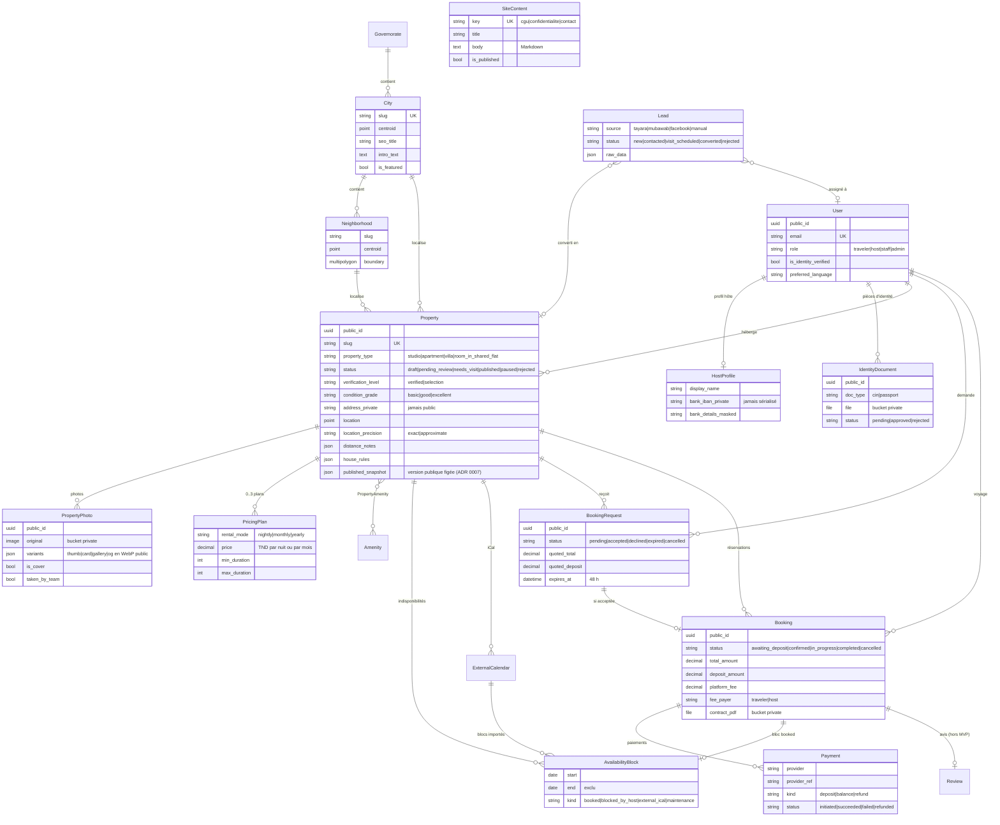
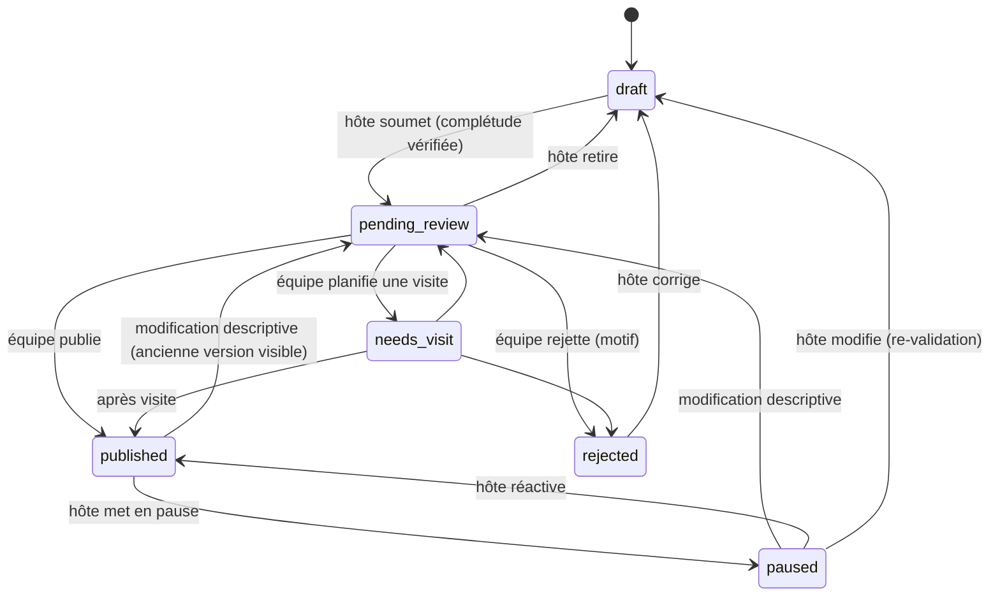

# Modèle de données

Toutes les entités publiques exposent un `public_id` (UUID) dans les URLs ; les IDs séquentiels ne sortent jamais de l'API. Les statuts changent uniquement via les services (ADR 0003) et chaque transition est journalisée dans `StatusLog`.

## Machines à états

### Property

ADR 0007 : un bien est modifiable dans tous les états. Sur un bien publié ou en pause, les champs descriptifs et les photos renvoient en `pending_review` tandis que `published_snapshot` (version publique figée à la publication) reste servie par l'API publique ; prix, calendrier, règles et conditions s'appliquent sans revalidation. La soumission exige une pièce d'identité approuvée pour l'hôte.

### BookingRequest

`pending` → `accepted` (crée un `Booking` et un bloc `booked`), `declined`, `expired` (tâche Celery après 48 h, rappel hôte à 24 h) ou `cancelled` (par le voyageur). Les états d'arrivée sont terminaux. Accepter une demande refuse automatiquement les autres demandes en attente qui chevauchent les dates.

### Booking

`awaiting_deposit` → `confirmed` (webhook de paiement) → `in_progress` (jour d'arrivée) → `completed` (jour de départ). `cancelled` est possible depuis `awaiting_deposit` et `confirmed` ; le bloc de disponibilité est libéré et le remboursement suit l'ADR 0005.

## Contraintes base de données

- `availability_no_overlapping_bookings` : contrainte d'exclusion PostgreSQL (`btree_gist`) sur `daterange(start, end, '[)') && ` et `property =`, limitée à `kind = 'booked'`. Deux réservations d'un même bien ne peuvent jamais se chevaucher, même en cas de course entre deux requêtes.
- `availability_end_after_start` : `end > start`.
- `lead_unique_source_url` : une URL d'annonce n'est importée qu'une fois.
- `PricingPlan (property, rental_mode)` unique : un plan par mode.

## Données sensibles

| Donnée | Stockage | Exposition |
|---|---|---|
| `Property.address_private` | colonne | hôte du bien, staff (journalisé), voyageur d'une réservation confirmée (journalisé) |
| `IdentityDocument.file` | bucket privé, nom généré | URL signée 5 min via `/download/`, journalisé |
| `PropertyPhoto.original` | bucket privé | jamais ; seules les variantes WebP publiques sont servies |
| `Booking.contract_pdf` | bucket privé | URL signée via `/contract/`, journalisé |
| `HostProfile.bank_iban_private` | colonne | jamais sérialisé ; seul `bank_details_masked` sort |
