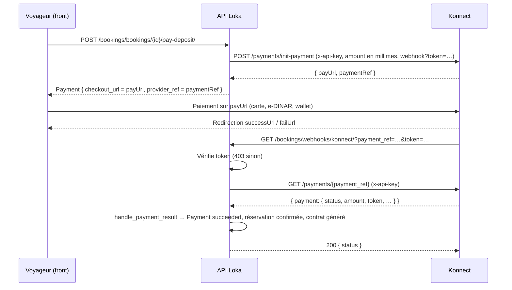

# Paiements

Loka encaisse uniquement l'**acompte** qui confirme une réservation (ADR 0005). Le reste se règle
entre l'hôte et le voyageur. Un seul prestataire est actif à la fois (`PAYMENT_PROVIDER`).

## Architecture : `PaymentProvider`

`bookings/payments/base.py` définit le contrat commun (Protocol) :

| Méthode | Rôle |
|---|---|
| `create_checkout(amount, currency, reference, description, success_url, cancel_url)` | Crée une session de paiement chez le prestataire → `CheckoutSession(provider, provider_ref, checkout_url, raw)` |
| `parse_webhook(payload, headers)` | Vérifie une notification du prestataire → `PaymentResult(provider_ref, succeeded, amount, currency, raw)` |
| `refund(provider_ref, amount)` | Rembourse (tout ou partie) un paiement encaissé |

`get_payment_provider()` instancie l'implémentation choisie par `PAYMENT_PROVIDER` (`mock` ou
`konnect`). La couche services (`bookings/services.py`) ne connaît que ce contrat :

- `start_deposit_payment(booking)` appelle `create_checkout` et enregistre un `Payment` en statut
  `initiated` avec `provider_ref` et `checkout_url` ;
- `handle_payment_result(result)` est **idempotent** : il retrouve le `Payment` par `provider_ref`,
  vérifie le montant (`amount_mismatch` sinon), le passe en `succeeded` / `failed`, confirme la
  réservation et lance la génération du contrat ;
- `cancel_booking(booking)` appelle `refund` si la politique d'annulation prévoit un remboursement.

## Mock (dev et tests)

`PAYMENT_PROVIDER=mock` (valeur par défaut). Le `checkout_url` pointe vers la page front
`/paiement/mock`, qui simule un succès ou un échec en appelant `POST /bookings/webhooks/mock/`
avec une signature HMAC dérivée de `SECRET_KEY` (impossible à forger depuis le navigateur). Aucun
appel réseau externe.

## Konnect

[Konnect](https://konnect.network) est une passerelle tunisienne (cartes bancaires, e-DINAR,
wallets Konnect). Implémentation : `bookings/payments/konnect.py` (`KonnectPaymentProvider`),
sans dépendance supplémentaire (`urllib`, délai 15 s).

### Mise en place

1. Créer un compte marchand Konnect et un **wallet** ; noter son identifiant (`KONNECT_WALLET_ID`).
2. Générer une **clé API** dans le tableau de bord (`KONNECT_API_KEY`). Ne jamais la committer ni
   la logger : le code ne l'écrit nulle part, `KonnectError` ne contient que le statut HTTP et un
   extrait du corps de la réponse.
3. Choisir l'environnement : `KONNECT_SANDBOX=1` (défaut) cible
   `https://api.preprod.konnect.network/api/v2`, `KONNECT_SANDBOX=0` cible
   `https://api.konnect.network/api/v2`. Les clés sandbox et production sont distinctes.
4. Générer un jeton de webhook aléatoire : `openssl rand -hex 32` → `KONNECT_WEBHOOK_TOKEN`.
5. Renseigner `KONNECT_WEBHOOK_URL` avec l'URL **publique de l'API** (pas celle du front) :
   `https://api.loka.tn/api/v1/bookings/webhooks/konnect/`. Le prestataire y ajoute
   `?token=<KONNECT_WEBHOOK_TOKEN>` et transmet l'URL complète à chaque `init-payment` : il n'y a
   rien à enregistrer côté tableau de bord Konnect, mais l'URL doit être joignable depuis Internet
   (en dev local, utiliser un tunnel type ngrok et mettre son URL dans `KONNECT_WEBHOOK_URL`).
6. `PAYMENT_PROVIDER=konnect`. Au démarrage, un `ImproperlyConfigured` est levé si la clé API ou
   le wallet manquent.
7. Optionnel : `KONNECT_CHECKOUT_LIFESPAN_MINUTES` (30 par défaut), durée de validité du lien de
   paiement.

### Montants

Konnect travaille en **millimes** (1 TND = 1000 millimes, entier). `tnd_to_millimes` convertit
exactement les `Decimal` TND et refuse tout montant non représentable (ex. `0.0005`) ou nul ;
`millimes_to_tnd` fait l'inverse pour comparer avec `Payment.amount`. Seule la devise `TND` est
acceptée.

### Flux



Le webhook Konnect **n'est pas signé** (d'après la documentation publique) : l'API ne fait donc
jamais confiance au ping. Elle relit l'état réel via `GET /payments/{ref}` et n'applique que
`status == "completed"`. Tout autre statut (`pending`, `expired`, `failed`…) marque le
`Payment` en `failed` sans toucher à la réservation, qui reste `awaiting_deposit` (un nouveau
`pay-deposit` crée alors une nouvelle session). Réponses du webhook : `200 {"status"}`,
`400` sans `payment_ref`, `403` jeton invalide ou prestataire non actif, `404` référence inconnue,
`502` si Konnect est injoignable (Konnect réessaie ; on peut aussi réconcilier à la main).

Les URLs de retour (`successUrl` / `failUrl`) ramènent le voyageur sur
`/compte/reservations/{id}?paiement=ok|annule` ; elles ne prouvent rien, seule la relecture de
l'API fait foi.

### Réconciliation manuelle

Si un webhook s'est perdu (Konnect indisponible, API en déploiement…) :

```sh
docker compose run --rm api python manage.py check_payment <provider_ref>
```

La commande affiche `status`, montant et devise renvoyés par Konnect. Si le paiement est
`completed`, elle appelle `handle_payment_result` exactement comme le webhook (idempotent : relancer
ne change rien). Sinon elle n'écrit rien.

### Remboursements

L'API publique Konnect ne documente pas de remboursement : `KonnectPaymentProvider.refund` lève
`NotImplementedError`. **Les remboursements se font manuellement depuis le tableau de bord
Konnect** pour l'instant.

Conséquence dans `cancel_booking` (`bookings/services.py`, inchangé) : quand la politique prévoit
un remboursement et qu'un acompte `succeeded` existe, `provider.refund(...)` est appelé dans la
transaction ; avec Konnect l'exception `NotImplementedError` **remonte** jusqu'à la vue, la
transaction est annulée et la réservation **n'est pas annulée** (HTTP 500 côté client). Point
ouvert à traiter dans `services.py` : par exemple enregistrer un `Payment` de type `refund` en
statut `initiated` (à solder manuellement) plutôt que d'appeler le prestataire, ou intercepter
`NotImplementedError` et notifier l'équipe.

### Points à confirmer avec Konnect (TODO)

- [ ] Existe-t-il une signature ou un secret de webhook ? (`TODO(konnect)` dans
      `parse_webhook`) ; en attendant, vérification par relecture de l'API + jeton d'URL.
- [ ] Méthode HTTP exacte du webhook (GET avec `payment_ref` selon la doc ; la vue accepte aussi
      POST JSON) et politique de réessai de Konnect en cas de non-200.
- [ ] Liste exhaustive des statuts de paiement (`pending`, `completed`, `expired`, `failed`…) et
      sens de `payment.amount` avec `addPaymentFeesToAmount: false` (montant demandé vs net).
- [ ] Endpoint de remboursement (partiel / total) ou procédure officielle.
- [ ] Valeur attendue de `acceptedPaymentMethods` selon le contrat marchand (e-DINAR activé ?).
- [ ] Limites de `lifespan` et comportement à expiration (webhook envoyé ou non).
